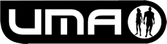
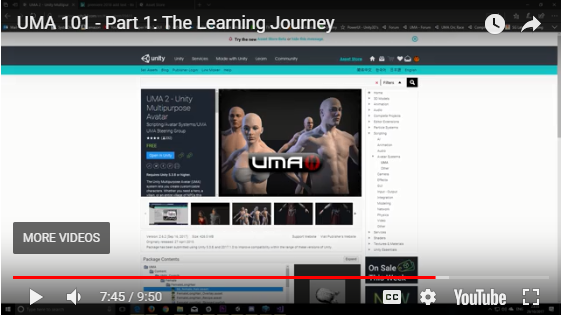

Unity Multipurpose Avatar System, or UMA for short, is a free character creation and modification system with lots of cool features. UMA was designed with flexibility in mind, so although it's primary purpose is for working with humanoid characters, its systems can be adapted to work with any model you like. So if you want to create modifiable, optimised models for use in your games. UMA is the place to start. As a community project UMA is always being improved. Although the best efforts are made to keep this wiki up to date, it relies on the spare time of helpful individuals to maintain. If you want more help or feel like chipping in then get involved with one of the community links below.

Git repo: https://github.com/umasteeringgroup/UMA

Wiki:     http://umadocs.secretanorak.com/doku.php?id=start

Forum:    http://forum.unity3d.com/threads/uma-unity-multipurpose-avatar-on-the-asset-store.219175

License:  MIT

]
