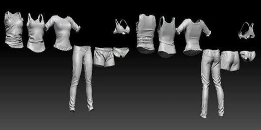
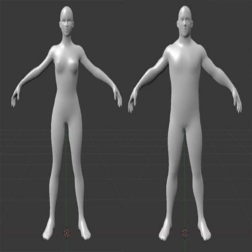
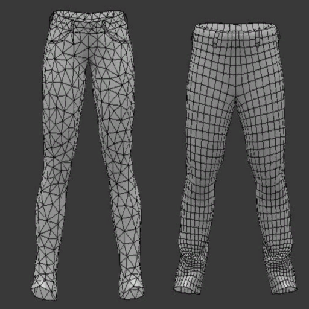
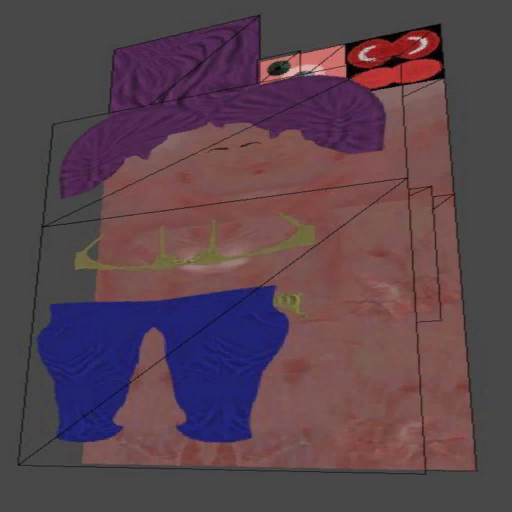
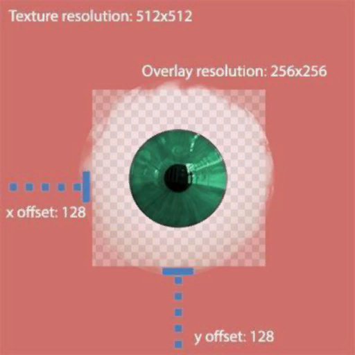
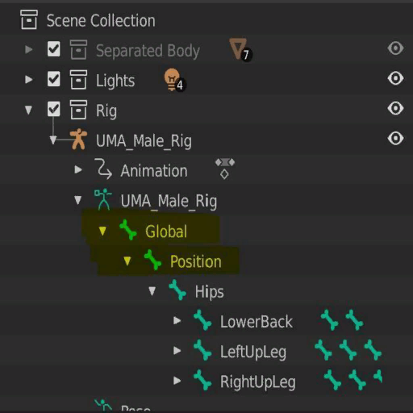
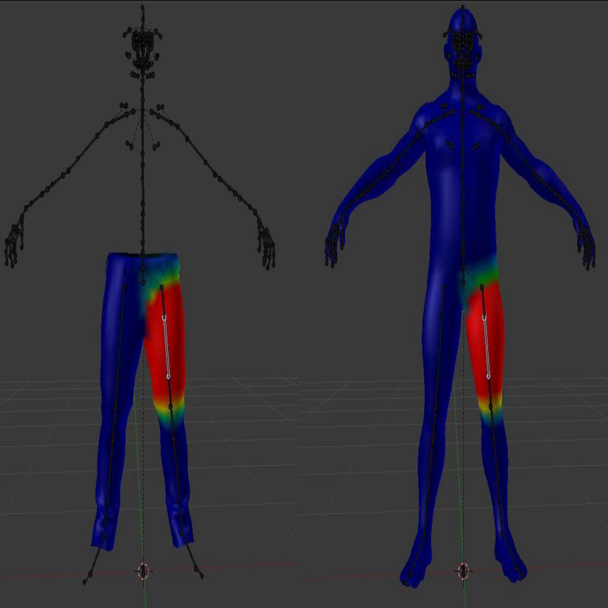

# UMA Content Creation

This guide is for artists and technical artists creating bodies, clothing, hair, accessories, and texture variations for UMA 3. It follows the work from a DCC package into Unity, then through UMA's Slot Builder, overlay, and wardrobe tools.

The most important rule is simple: build and test against the exact race you intend to support. UMA can combine and reshape content at runtime, but it cannot repair an incompatible skeleton, missing weights, broken UVs, or a poor neutral fit.

For Scene Mesh Slot Builder, Bone Builder, Prefab Maker, and generated-character prefab saving, see [Prefab and Scene-Building Tools](PrefabAndSceneBuildingTools.md). The broader editor-tool directory is [UMA Editor Utilities](UMAEditorUtilities.md).

## The UMA Content Model

UMA assembles a character from a few reusable asset types:

- A `RaceData` asset defines the character family, base body, rig, DNA, wardrobe regions, and compatibility.
- A `SlotDataAsset` supplies mesh data such as a body section, shirt, hair mesh, or accessory.
- An `OverlayDataAsset` supplies textures and blending instructions.
- A `UMAMaterial` tells UMA which shader and texture channels those overlays use.
- A `UMAWardrobeRecipe` packages slots, overlays, hiding rules, and optional mesh modifications into an equippable item.

An avatar is not one permanent mesh. During generation, UMA resolves the race and wardrobe recipes, combines compatible slots, composites or assigns overlay textures, applies DNA and mesh modifications, and publishes the resulting renderers.

## Decide What You Are Making

Before opening a modeling package, decide which category the asset belongs to.

### Texture-only variation

Use an overlay when the existing mesh already has the shape you need. Examples include:

- Skin complexion
- Makeup and tattoos
- Fabric color or printed patterns
- Dirt, scars, and surface detail
- Iris variations

Texture-only content is usually the least expensive content to produce and generate.

### Mesh wearable

Use a new slot when the silhouette or deformation changes. Examples include:

- Shirts, trousers, armor, and shoes
- Hair meshes
- Jewelry and rigid accessories
- Prosthetics or replacement body parts

Most wearable slots also need one or more overlays and a wardrobe recipe.

### New race or body family

Create a new race when the character needs a different base mesh, rig, rest pose, DNA behavior, expression setup, or wardrobe compatibility model. A race can still share wardrobe with another race through explicit cross-compatibility mappings.

## Prepare a Reliable Reference

Use the current base mesh and skeleton for the target race as your source of truth.

1. Export or locate the race's neutral body and armature.
2. Work in the same neutral pose used by the race assets.
3. Keep the source body visible while modeling clothing.
4. Preserve the source object's scale, orientation, and skeleton hierarchy.
5. Do not rename bones on a wearable export.

For clothing, start close to the neutral body without pushing the garment deeply through it. Leave deliberate clearance for animation and body DNA. Tight clothing often needs mesh hides, a conforming workflow, or carefully authored corrective deformation.

## Modeling for Deformation

Good UMA topology follows the same principles as any production skinned character:

- Place enough loops around shoulders, elbows, hips, knees, and other bending areas.
- Avoid long, thin triangles in highly deformable areas.
- Keep polygon density proportional to silhouette and deformation needs.
- Remove unseen geometry when it provides no useful deformation or shadowing.
- Test extreme race DNA, not only the neutral body.
- Keep hard-surface pieces rigid through weighting or separate construction instead of excessive topology.

Different slots do not need identical topology. They do need to deform compatibly with the target body.

### Body seams

Separated body slots need special care at shared borders. A visible seam can be caused by:

- Different border-vertex positions
- Different normals or tangents
- Different skin weights
- Different UV placement
- Different DNA or blendshape behavior

Keep a unified version of a new body whenever possible. The unified mesh can be used as the Slot Builder's optional seam-reference mesh so separated body slots inherit consistent normals and tangents.

## UV Layout and Texturing

UMA can combine many slots and overlays into generated textures. Plan UVs for that workflow.

### UV rules

- Atlas content normally needs UVs in the `0..1` range.
- Use the same UV layout when an overlay must line up across several compatible slots.
- Avoid unintended overlap unless the shader and material workflow explicitly expects it.
- Keep enough padding around islands for mipmaps and texture filtering.
- Verify the slot in Slot Builder before creating production textures.
- Use the UDIM adjustment options only when the source mesh intentionally uses numbered UV tiles.

### Cropped overlays

An overlay does not have to occupy the full base texture. Cropping a small detail to its useful area can save source texture memory.

Set the overlay `Rect` in normalized UV coordinates. The rect places the cropped texture into the correct part of the base UV layout regardless of the source image resolution.

When authoring cropped overlays:

1. Preserve the same pixel density as nearby base artwork.
2. Add padding beyond the visible alpha edge.
3. Enter the matching normalized rect on the `OverlayDataAsset`.
4. Test at distance with mipmaps enabled.

### Texture channels

The overlay texture order must match the assigned `UMAMaterial` channel order. A typical material may use:

- Albedo or base color
- Normal map
- Mask, metallic, smoothness, or occlusion data
- Skin masks, thickness, detail, or project-specific channels

Do not assume every material uses the same packing. Open the `UMAMaterial`, read its channel property names, and prepare textures accordingly.

For overlays layered above a base overlay, the first texture's alpha is normally used as the mask unless a separate alpha mask is assigned.

## Rigging and Skinning

UMA clothing must follow the same skeleton and deformations as the target race.

Use the race's existing armature when creating a wearable. Retain the required root hierarchy and every bone used by the mesh. If the source race includes `Global` and `Position`, preserve them rather than reconstructing or renaming the hierarchy.

### Weight-transfer workflow

1. Fit the garment to the neutral body.
2. Transfer weights from the closest body surface.
3. Inspect every major bend manually.
4. Clean weights around layered or loose fabric.
5. Remove accidental influence from unrelated bones.
6. Confirm that every weighted bone exists in the target race.

### Blender weight transfer

In Blender, a Data Transfer modifier with vertex-group transfer and nearest-face interpolation is a useful starting point. Apply the modifier before export, then refine the result with weight painting.

For dresses, coats, armor, or geometry far from the body, transferred weights are only a starting point. Test with animations and extreme DNA values.

### Maya authoring and weight transfer

Use the target race's original skeleton as the Maya reference. Do not rebuild, freeze, reorient, or rename its joints. Maya joint orientation is part of the bind pose, and cleaning the skeleton like an ordinary transform hierarchy can make an otherwise correct garment twist in Unity.

Recommended Maya workflow:

1. Set the scene to the same neutral pose and scale as the target race.
2. Import or reference the race body and skeleton.
3. Model the wearable around the neutral body.
4. Before skinning, delete construction history from the new garment and freeze transforms only on the unskinned garment when the source pipeline requires it.
5. Bind the garment to the joints used by the nearby body area.
6. Select the source body first and the garment second.
7. Open `Skin > Copy Skin Weights`.
8. Start with `Closest point on surface` for surface association and `Name` as the first influence association. Use `Closest joint` as a fallback only when the names cannot be matched.
9. Normalize the copied weights, remove unintended influences, and paint or smooth problem areas manually.
10. Return to the bind pose and test shoulders, elbows, hips, knees, and any area affected by strong DNA changes.

Keep the maximum influence count consistent with the project's Unity skin-weight quality. Do not prune a working deformation to four influences merely because it is a familiar game convention; use the project's measured platform limit.

For loose garments, copy weights section by section when a single nearest-surface transfer reaches across folds or between legs. Maya's transferred weights are a starting point, not a finished deformation pass.

After importing and building the slot, [Weight Touchup](WeightTouchup.md) can correct small skinning problems directly on a generated character in a revealing pose. It saves changes to the source `SlotDataAsset`, so use it for final UMA-side corrections rather than per-character adjustments.

### Additional bones

Hair, tails, cloth rigs, and accessories may need extra bones. Ensure that:

- The bones are included in the exported armature.
- The slot is weighted to them.
- Required parent bones are retained.
- The Slot Builder's `Keep Bones Containing` list preserves helpers that are not otherwise referenced.
- The animator or a UMA bone animator drives them at runtime.

Use `Keep All Bones` only when the entire armature is genuinely required. It increases generated skeleton and processing cost.

## Blendshapes

Blendshapes can support facial animation, body forms, and corrective deformation. A wearable that must follow a body blendshape needs a compatible blendshape or another correction strategy.

Before committing to a blendshape-heavy workflow:

- Match blendshape names across compatible slots.
- Keep vertex order and topology stable for every frame.
- Test whether the DCA is configured to load blendshapes.
- Decide whether normals and tangents must be stored with the frames.
- Use race prebaking or Mesh Modifiers when the final deformation does not need to remain a live blendshape.

For extracting existing slot blendshapes into Mesh Modifiers, see [MeshModifiers.md](MeshModifiers.md).

## Export from Blender 4.x

UMA Tools for Blender provides UMA-specific error checking, rigging and weight utilities, UDIM helpers, and a consistent FBX export preset. Download it and follow its preflight workflow in [UMA Tools for Blender](UMAToolsForBlender.md).

Normalize the asset before export:

1. Select the mesh and armature.
2. Apply object location, rotation, and scale where appropriate for the source rig.
3. Confirm the neutral pose is the intended rest pose.
4. Export the armature and the required skinned meshes together.
5. Do not export cameras, lights, or unrelated meshes.

The established UMA Blender 4.x FBX orientation is:

- Forward Axis: `Z Forward`
- Up Axis: `Y Up`
- Primary Bone Axis: `X Axis`
- Secondary Bone Axis: `-Y Axis`
- Apply Scalings: `FBX All`

With a correctly normalized source and those settings, Unity should normally import the asset without a compensating scale change. Always verify against the target race rather than relying only on numeric settings.

## Export from Maya

Before exporting:

1. Return the character to the original bind or neutral pose.
2. Confirm the garment is bound to the target UMA skeleton.
3. Remove unused influences and normalize the skin weights.
4. Use `Edit > Delete by Type > Non-Deformer History` when cleanup is needed. Do not use ordinary Delete History on a finished skinned mesh if it would remove the skin cluster or blendshape deformers.
5. Remove namespaces when they would become part of exported joint names.
6. Select the garment and the complete required skeleton hierarchy.
7. Use `File > Export Selection` and choose FBX.

Recommended FBX options:

- Enable `Smoothing Groups`.
- Export authored normals and tangents when the project relies on them; otherwise let the established Unity import settings calculate them consistently.
- Under `Deformed Models`, enable `Skins`.
- Enable `Blend Shapes` only when the slot needs live blendshapes.
- Disable animation for an ordinary wearable export.
- Disable cameras, lights, constraints, and embedded media unless the asset deliberately needs them.
- Leave unit conversion on the studio's tested automatic/default path and keep Maya's native Y-up orientation.

Do not freeze transformations on the bound skeleton or zero `jointOrient` values before export. If Unity imports the garment at a different scale than the reference race, correct the Maya scene and FBX unit pipeline instead of compensating with a unique scale on every slot.

For blendshape wearables, keep the base garment topology and vertex order unchanged. Verify that the blendshape node and skin cluster are both exported, and use the same blendshape names as the compatible body slots.

## Import into Unity

After importing the FBX:

1. Inspect its scale and orientation in a neutral scene.
2. Confirm Unity created a `SkinnedMeshRenderer`.
3. Inspect the bone list and root bone.
4. Verify the mesh is not stretched toward the origin. That usually indicates missing or incorrect bone weights.
5. Confirm normal-map textures are imported as normal maps.
6. Configure the Rig tab for the animation workflow used by the race.
7. Apply the import settings before opening Slot Builder.

If the mesh looks correct as a standalone GameObject but rotates, scales, or stretches after becoming a slot, the usual causes are unapplied transforms, an incompatible root hierarchy, or weights targeting missing bones.

## Create the Slot

Open:

`UMA > Content Creation > Slots > Slot Builder`

### Important Slot Builder fields

- `Seams Mesh`: optional unified reference mesh used to correct border normals and tangents.
- `Slot Destination Folder`: folder where UMA writes the generated assets.
- `Is Base Race Recipe`: changes the recipe workflow from wearable creation to base-race creation.
- `Create Overlay`: creates an empty overlay for the slot.
- `Create Wardrobe Recipe`: creates an equippable recipe for wearable content.
- `Binary Serialization`: recommended for large meshes and blendshape-heavy slots.
- `Add To Global Library`: indexes the generated UMA assets immediately.
- `Adjust for UDIM`: moves numbered UV tiles into the expected tile space.
- `Calculate Tangents`: generates tangents when the source data does not provide usable values.
- `Clear Blendshape Normals` and `Clear Blendshape Tangents`: reduce stored frame data when the project does not need it.
- `Keep All Bones`: retains the whole source hierarchy; use sparingly.
- `Keep Bones Containing`: retains specifically named helper bones.
- `Generate Slot LODs`: builds internal per-slot LOD triangle ranges for `UMASimpleLOD`.

### Single-slot workflow

1. Expand the imported FBX in the Project window.
2. Assign its `SkinnedMeshRenderer` to `Slot Mesh`.
3. Assign the destination folder and optional seam mesh.
4. Select the desired creation options.
5. Click `Verify Slot`.
6. Correct scale, UV, or mesh warnings.
7. Click `Create Slot`.
8. Inspect the generated `SlotDataAsset`, overlay, and recipe.

### Batch workflow

Drop an FBX onto the batch area to collect its skinned renderers. Filter and select the renderers, configure the common options, and use `Process checked slots`. Review the results window instead of assuming every submesh used the intended material and name.

## Author the Overlay

For each generated overlay:

1. Give it a unique, stable overlay name.
2. Assign the same `UMAMaterial` expected by the slot.
3. Match the overlay texture count to the material channel count.
4. Assign each texture to the property-labelled channel.
5. Choose blend modes for non-base overlays.
6. Set a normalized `Rect` when the textures are cropped.
7. Assign an optional alpha mask when texture zero does not provide the desired mask.
8. Add useful overlay-group and tag metadata.

The first overlay on a slot is the base. It should normally provide every texture required to establish the material. Later overlays may intentionally leave channels empty when they only modify selected channels.

See [OverlayDataAsset.md](OverlayDataAsset.md) and [UMAMaterial.md](UMAMaterial.md).

## Build the Wardrobe Recipe

Open or create a `UMAWardrobeRecipe`, then:

1. Add the supported races.
2. Choose the wardrobe region.
3. Add the new slot.
4. Add its base overlay and any additional layers.
5. Configure body-slot hiding, mesh hides, clipping, or smooshing.
6. Add mesh modifiers only when the item needs a repeatable geometry correction.
7. Test the recipe on every compatible race.

See [WardrobeRecipeEditor.md](WardrobeRecipeEditor.md).

## Creating a New Race

A production race normally needs:

- A `RaceData` asset
- A valid base recipe or FBX-route renderer
- A T-pose for Humanoid generation
- Wardrobe regions
- DNA groups or legacy DNA converters
- Animator and expression configuration
- Manual bounds when automatic bounds are insufficient
- Cross-compatibility mappings when sharing wardrobe

For a traditional base recipe, a unified seam-reference body plus separated body slots is a practical authoring pattern. The unified mesh maintains continuity; the separated slots allow wardrobe to hide or replace body areas.

Extract a T-pose by selecting the model and using `Assets > UMA > Extract T-Pose`, or use the Animator component context command `Extract UMA T-Pose`.

For the complete start-to-finish workflow, see [Creating a New Race](CreatingANewRace.md). See [RaceData](RaceData.md) for a field-by-field reference.

## Validation Checklist

Before shipping an item:

- The slot passes `Validate`.
- UVs and overlay rects align.
- Every overlay channel matches the `UMAMaterial`.
- Normal maps are imported correctly.
- The neutral fit has deliberate clearance.
- Shoulder, elbow, hip, and knee animation does not collapse the mesh.
- Extreme body DNA does not expose severe clipping.
- Mesh hides do not remove visible skin.
- Blendshapes load only when required.
- LOD transitions preserve the silhouette and do not open seams.
- The recipe works after rebuilding the Global Library.
- The item works in a player build, not only in the editor.

## Common Problems

### The mesh is the wrong size

Apply transforms in the DCC package and verify the FBX export scale. Avoid fixing every asset with a different Unity import scale unless the source pipeline requires it.

### The slot rotates after generation

Check applied rotation, FBX axes, armature orientation, and the race's `Fixup Rotations` setting.

### Vertices stretch toward the floor or origin

One or more vertices are weighted to a missing or incompatible bone. Inspect weights and ensure the exported hierarchy contains every influence.

### Body seams are visible

Compare border positions, normals, tangents, weights, UVs, and DNA behavior. Rebuild separated body slots using a unified seam-reference mesh.

### Textures are missing or appear in the wrong shader channel

The overlay texture list does not match the assigned `UMAMaterial` channels, or the material property name does not match the shader.

### Clothing fits the neutral body but clips after customization

Test extreme DNA, improve skinning, add mesh hides, author a corrective Mesh Modifier, or use the Clothing Conformer where appropriate.

## Related Guides

- [GettingStarted.md](GettingStarted.md)
- [CreatingANewRace.md](CreatingANewRace.md)
- [RaceData.md](RaceData.md)
- [SlotDataAsset.md](SlotDataAsset.md)
- [WeightTouchup.md](WeightTouchup.md)
- [OverlayDataAsset.md](OverlayDataAsset.md)
- [UMAMaterial.md](UMAMaterial.md)
- [RendererAssetsAndCloth.md](RendererAssetsAndCloth.md)
- [WardrobeRecipeEditor.md](WardrobeRecipeEditor.md)
- [MeshModifiers.md](MeshModifiers.md)
- [MeshHideAssets.md](MeshHideAssets.md)
- [UMASimpleLOD.md](UMASimpleLOD.md)
