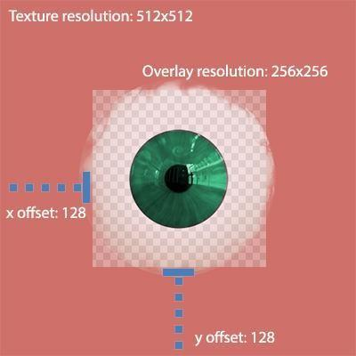

# OverlayDataAsset

An `OverlayDataAsset` describes an image layer that UMA can place on a slot. Skin details, makeup, tattoos, scars, fabric color, clothing graphics, cutouts, and many other surface details are overlays.

The asset does not contain a second mesh. It identifies textures, material behavior, placement, blend settings, and optional occlusion data used while UMA builds the character's final materials.

For batch completeness checks, dependency-folder validation, material assignment, texture relinking, and controlled folder synchronization, see [Examine Overlays](ExamineOverlays.md).

## Where Overlays Fit

UMA assembles surface content in this order:

1. A `SlotDataAsset` supplies the mesh and its UMA Material.
2. The first overlay normally provides the base surface for that slot.
3. Additional overlays add details or modify the base.
4. The generator composites compatible channels or assigns existing textures, depending on the UMA Material type.
5. The generated material is assigned to the character renderer.

All overlays on the same slot should be authored for the same UV layout unless a specialized shader workflow deliberately does something else.

## Create an Overlay

You can create an overlay with:

- **Assets > Create > UMA > Core > Overlay Asset**, then assign its textures and material.
- **Slot Builder**, when importing a new slot and its first overlay together.

Recommended artist workflow:

1. Prepare textures using the slot's UV layout.
2. Create the overlay in the same content area as the slot or outfit.
3. Give it a stable, unique UMA name.
4. Assign the same UMA Material family expected by the target slot.
5. Fill channels in the exact order defined by that UMA Material.
6. Add the overlay to a recipe and test it on the character.

## Overlay Name

The overlay name is its runtime lookup key. Treat it like an asset identifier:

- Use a unique, descriptive name.
- Keep it stable after recipes or save data ship.
- Avoid relying only on the Unity filename to distinguish similar content.

Duplicate UMA names can make the wrong overlay resolve from the Global Library.

## Overlay Type

The common types are:

- **Normal** - contributes textures and color information to the material.
- **Cutout** - removes or hides a defined part of the surface according to its setup.

Choose the type for the intended recipe behavior. A cutout overlay is not a substitute for a Mesh Hide Asset when physical triangles must be removed.

## UMA Material

The overlay's UMA Material determines:

- Which shader the generated material uses.
- Which texture channels are expected.
- Whether those channels are atlased, used without an atlas, copied directly, or assigned through an existing material.
- How overlay color and blend data affect the result.

The slot and overlay must use compatible UMA Materials. If they do not, the overlay may be ignored, split into another generated material, or produce unexpected channel results.

See [UMA Material](UMAMaterial.md).

## Texture Channels

The texture list follows the UMA Material's channel order. For example, a skin material might define:

- Base color or albedo
- Normal map
- Mask map
- Skin mask or other shader-specific data

The names are controlled by the UMA Material, not by the overlay. Match both channel order and texture type.

The base overlay should provide every channel needed to establish the surface. Additional overlays may leave some channels empty when the material and blend workflow allow it.

For artist-authored textures:

- Use the same dimensions and UV alignment across related channels.
- Import normal maps with Unity's normal-map texture type.
- Disable color-space treatment for masks and packed data when appropriate.
- Keep padding around UV islands to prevent mipmap and atlas bleeding.
- Avoid unnecessarily high resolution; the generator cannot restore detail that is not visible at the final atlas size.

## Blend Modes

Additional overlays can blend differently per channel. Use blend modes deliberately:

- Color details often use normal, multiply, overlay, or another art-directed blend.
- Normal details need a normal-compatible channel and blend setup.
- Masks and packed maps usually need mathematically predictable blending.

Always judge the result on the final UMA material. A texture that looks correct in an image editor can produce a different result once color space, tinting, channel packing, mipmaps, and shader interpretation are applied.

## Overlay Color and Shared Colors

Overlay color can tint the overlay and control channel masks. Shared colors let several overlays use one named character color, such as skin, hair, or eyes.

Use shared colors when content should respond to the same customization control. This makes outfits and character presets easier to maintain.

When a tint appears ineffective, check:

- The shader property supports tinting.
- The UMA Material channel is configured to receive color.
- The overlay uses the intended shared color.
- Channel masks are not suppressing the tint.

### Transparent Multiplier

**Transparent Multiplier** controls the RGB prefill used inside this overlay's destination area before compositing. UMA multiplies the overlay's current channel color by this value and writes that color behind transparent pixels. `Color.clear` disables the prefill.

Transparent pixels can still carry RGB data even though their alpha is zero. Supplying suitable RGB around and beneath painted areas can reduce dark or discolored fringes after atlas scaling, filtering, mipmap generation, or later blending. This is especially useful for cropped overlays and sparse details whose transparent borders are sampled at a distance.

Choose the value for the meaning of each material channel:

- For base color, use a color compatible with the surrounding surface instead of an unrelated dark or saturated color.
- For normal maps, preserve a neutral tangent-space normal behind transparent detail rather than introducing a directional normal.
- For masks or packed data, use neutral values appropriate to each packed component.
- Use `Color.clear` when the overlay's existing transparent RGB is intentional or prefill is not needed.

Judge the result on the generated atlas and final shader at lower mip levels. A value that removes a color fringe in the albedo channel can be incorrect for a normal or packed mask channel.

## Rect and Cropped Overlays

An overlay rect defines where a cropped overlay is placed relative to the full texture area. This is useful for small localized details such as tattoos, scars, makeup, emblems, or decals.

When authoring cropped overlays:

- Keep the source rect aligned with the target UV area.
- Leave padding around painted pixels.
- Test mipmaps and lower atlas resolutions.
- Check mirrored or overlapping UVs.
- Document the intended base texture size if several artists create compatible content.

## Alpha Mask

The alpha mask controls where an overlay contributes. Treat it like an artist-authored influence map:

- White applies the overlay.
- Black protects the underlying surface.
- Gray creates partial influence.

Soft transitions can reduce seams, but excessive blur may make a detail look muddy. Test at the atlas resolutions used on the target platforms.

## Occlusion and Cutout Data

Overlay occlusion entries can associate cutout behavior with slots. Use the inspector's slot references or drag-and-drop controls to define the affected content.

Choose the correct hiding method:

- Use a cutout or alpha-based workflow when the shader should hide pixels.
- Use a compatible Mesh Hide Asset when hidden triangles should not be rendered.
- Use wardrobe suppression when one wardrobe item should replace another complete region.

Mesh Hide Assets must match the referenced slot's triangle metadata. UMA validates incompatible assets and skips them rather than attempting an unsafe combine.

## Tags and Group

Tags and grouping help tools, filters, and runtime systems organize overlays. Use a consistent studio vocabulary such as body region, content pack, style, or customization category.

Tags do not repair recipe compatibility on their own. The recipe, slot, race, and material still need to agree.

## Add an Overlay to a Recipe

1. Open a base or wardrobe recipe in the UMA recipe editor.
2. Find the target slot.
3. Add the overlay to that slot's overlay stack.
4. Make sure the base overlay is first.
5. Set shared colors or overlay color values as needed.
6. Save the recipe.
7. Rebuild a DCA using the recipe.

Review the result under representative lighting, at gameplay camera distances, and with lower quality settings.

## Refreshing Edited Textures

When an overlay texture is replaced on disk, an existing cached overlay or generated character may still reference earlier data.

Recommended iteration loop:

1. Save or overwrite the texture in the Unity project.
2. Let Unity reimport it.
3. Use the overlay editor's refresh/reload workflow so the Global Library clears the cached overlay reference.
4. Rebuild affected avatars.

This is especially important for tools that save a generated normal or mask and immediately rebuild the character.

## Addressables

For Addressables content:

- Keep overlay names unique and stable.
- Confirm the overlay, its textures, and dependent UMA Material are included in the intended groups.
- Avoid name stripping or naming rules that create collisions.
- Test unloading and reloading content in a player build.

The editor may find an asset directly from the project even when a player build cannot.

## Performance Guidance

- Reuse shared overlays and shared colors where appropriate.
- Crop localized details instead of storing a full-size texture for every small decal.
- Keep channel count limited to what the shader actually consumes.
- Match source resolution to the final atlas and camera needs.
- Avoid duplicated textures in otherwise identical overlays.
- Check whether the UMA Material copies, composites, or directly reuses each channel.

Texture copying increases temporary memory, GPU upload work, and garbage-collection pressure. See [UMA Generator Setup](UMAGeneratorSetup.md) for platform tuning.

## Artist Validation Checklist

- The overlay has a unique, stable UMA name.
- The target slot uses the expected UV layout.
- Slot and overlay UMA Materials are compatible.
- Texture order matches the UMA Material channels.
- Normal and mask textures have correct Unity import settings.
- Base overlays provide the required channels.
- Cropped overlays have enough padding.
- Shared color names match the recipe and UI.
- Transparent Multiplier uses channel-appropriate neutral values or is disabled.
- Cutout or occlusion data targets the intended slots.
- The overlay is available in the Global Library.
- The result has been tested at gameplay distance and target atlas resolution.

## Troubleshooting

### The overlay is missing

- Confirm it is on the intended slot in the recipe.
- Confirm the overlay is indexed.
- Check the slot and overlay UMA Materials.
- Verify the overlay supports the active race and recipe workflow.

### One texture channel is not replaced

Check the UMA Material channel settings, especially **Use Existing Texture For Channel**. Atlas and No Atlas materials can intentionally keep an existing texture instead of compositing that channel.

### The normal map looks black at a distance

Check mipmap generation and conversion settings, normal-map import type, color space, and the shader's normal decoding. Zoomed-in detail with black distant mip levels usually indicates invalid regenerated mipmaps rather than missing base texture data.

### Seams appear around a cropped detail

Increase edge padding, check the crop rect, and preview lower mip levels. Texture dilation around painted pixels often fixes atlas bleeding better than simply increasing texture resolution.

### Changes do not appear after saving a texture

Refresh the overlay reference in the Global Library and rebuild the avatar. A cached `OverlayDataAsset` instance may still reference the earlier imported texture.

### A cutout hides the wrong area

Verify the target slot, UV layout, mask orientation, and occlusion entry. For triangle removal, use a Mesh Hide Asset created for that exact slot.

## Related Guides

- [Content Creation](ContentCreation.md)
- [SlotDataAsset](SlotDataAsset.md)
- [UMA Material](UMAMaterial.md)
- [DynamicCharacterAvatar](DynamicCharacterAvatar.md)
- [UMA Asset Indexer and Global Library](UMAAssetIndexer.md)
- [UMA Generator Setup](UMAGeneratorSetup.md)
