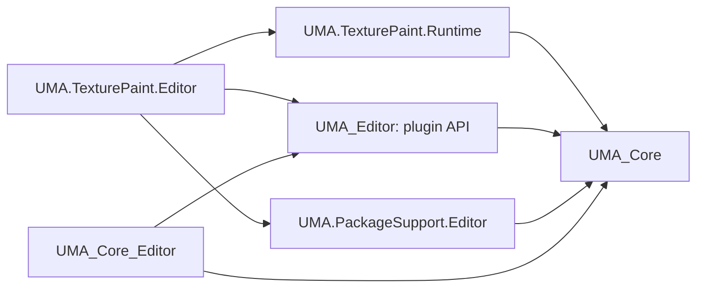

# UMA Plugin Migration Plan

Status: Launcher API version 1 and OverlayPainter migration implemented and validated. Other add-ons below remain follow-on candidates.
Date: 2026-10-04.
Reviewed checkout: `C:\GitHub\UMA\UMAProject`.
Installed UMA: `UMA NextGen 3.1f1`, read from `InternalDataStore/InGame/Resources/UMASettings.asset` after verifying its Unity YAML header.
Unity project version: `6000.3.18f1`. Supported baseline: Unity 6.3 and newer.
Original planning review: source, assembly, packaging, documentation, and verified-YAML dependency review. Implementation began on 2026-10-04 after user authorization. See [usage and packaging instructions](../Docs/UMAPlugins.md).

## 1. Intended result

### Implementation record — 2026-10-04

- Implemented attributed discovery, matching, deterministic ordering, validation, default-header placement, explicit host leases/adapters, deferred dispatch, cancellation, and exception isolation in `UMA_Editor`.
- Integrated recipe/wardrobe, DCA, and embedded UMAData hosts. Recipe synchronization protects pending edits and external revisions; the existing inline recipe plugin bridge remains supported.
- Removed core painter assembly references and hardcoded launch buttons. Painter-owned actions cover scene avatars and slots. Resource paths resolve from the painter's retained script GUID.
- Moved settings to a painter-owned Project Settings provider and project-data asset, with one-time legacy migration and scalar compatibility shims. Generic material channel metadata remains in core.
- Separated `OverlayPainter`, `OverlayPainterExamples`, and `OverlayPainterTests`; preserved moved asset GUIDs. Painter documentation travels with its package. Both editor and runtime tests live in the test companion.
- Extended the validated content installer catalog for official optional packages, launcher API compatibility, dependency checks, transaction recovery, and preservation of unowned files during updates. Removal deletes unchanged owned files and preserves modified files, user data, and recovery/settings assets.
- Added version-controlled builders and an isolated migration validator under `tools/Packaging`. Generated archives and the hash report are in `Build/Plugins`; `Build/CorePackage` excludes all three optional roots. Archive version `3.0.4` follows the actual package manifest; it is separate from the installed UMASettings label below.

Validation used `C:\GitHub\UMA\UMAProject` and a synchronized `tmp/UMAPluginCoreValidation` project, both Unity **6000.3.18f1**, with actual UMASettings **UMA NextGen 3.1f1**. Compilation completed with zero errors and warnings. Targeted tests passed: **15** launcher/recipe tests, **4** painter migration tests, and **19** document persistence tests. Deferred dispatch also passed a live-editor smoke check.

The isolated cycle passed core without painter assemblies/source, managed installation, action discovery, resource relocation, update, removal, a fresh editor launch after removal, reinstall, and recovery of authored data with unchanged GUIDs. It verified preservation of modified owned files, unowned files, settings, and documents. The separate test companion installed successfully and ran its persistence suite.

Validation limits: this is targeted plugin-migration validation, not a complete URP/HDRP/player-build or manual inspector-layout certification. The older generic content-release smoke test also requires an empty shipped AssetIndexer; the current checkout's populated indexer fails that independent release prerequisite. The plugin-specific core-absence check passes without altering the user's indexer or unsaved scene. A scene-sensitive test request in the main editor was canceled at its save prompt and rerun successfully in the isolated project.

The remaining sections retain the original migration design and follow-on candidate plans.

Ship OverlayPainter as an optional, versioned `.unitypackage`. Importing it into a compatible UMA project makes its existing painting workflows available automatically. A project without the package retains normal avatar generation, DNA, wardrobe, overlays, material authoring, and supported rendering.

Use the new UMA plugin API for editor discovery and launch buttons. OverlayPainter's own Plugin API v2 continues to manage its generators, filters, and brushes inside the optional package. These are separate extension systems.

The first migration preserves public types, assembly names, serialization, asset GUIDs, menus, document formats, and painting behavior. It changes ownership, dependencies, resource resolution, settings ownership, and launch-button integration. Engine rewrites and generator changes are outside this migration.

## 2. Prerequisite: implement the new UMA plugin API

The planning review found no launcher implementation. That prerequisite is now implemented in `Editor/General/Plugins`, with recipe, DCA, and embedded UMAData host integration. [UMAPlugin.md](UMAPlugin.md) records its public contract.

Follow the proposal as revised by its 2026-10-04 fitness review:

- Place the independent editor-only foundation under `Editor/General/Plugins/`, in `UMA_Editor`.
- Discover attributed static `void Action(UnityEditor.Editor editor)` methods through TypeCache and validate their metadata and optional validators.
- Match the actual inspected targets, including locked inspectors; keep ordering deterministic and disable unsupported multiple selection.
- Place matching actions in the Editors / Plugins area in Standard and Advanced View. Draw no area or spacing when nothing applies.
- Validate automatic header coverage in Unity 6.3 and use the proposed explicit host renderer only where needed.
- Use disposable explicit-host registrations to suppress duplicate header rendering; scope them to the actual Editor lifetime. A window with its own working buffer supplies an `IUMAPluginHost` adapter through that registration, coordinating any buffered Editor state as well.
- Dispatch against the captured inspector targets after the inspector finishes updating. Cancel stale clicks and prepare buffered editors through `IUMAPluginHost`, then refresh their working data after action edits. Applying SerializedObject or repainting alone is insufficient for detached recipe data.
- Publish launcher API version 1 and declare each package's required launcher API and supported UMA versions. Managed installation checks these before import; direct import requires a documented compatible UMA release.
- Preserve existing `IUMARecipePlugin` compatibility through the recipe-specific host bridge.
- Keep normal Unity windows, serialization, Undo, events, and cleanup. The API remains an editor launcher, without a runtime plugin loader or a custom lifecycle system.

Package installation and ownership belong to `UMA.PackageSupport.Editor`, separately from this launcher API. No new settings-panel API is needed: optional tools can own ordinary Unity SettingsProviders.

## 3. Required dependency direction

Core runtime and editor assemblies must compile without references to optional feature assemblies. Optional assemblies reference core and the launcher foundation. Tests for an optional feature travel with that feature and cannot be required by core test assemblies.

Preserve the existing `UMA.TexturePaint.Runtime`, `.Editor`, `.Examples`, and test assembly identities. The Runtime name does not justify moving its public API into an editor-only assembly during this packaging change.

## 4. OverlayPainter: current integration inventory

Paths below are relative to `Assets/UMA`.

| Current integration | Evidence | Migration decision |
| --- | --- | --- |
| Core editor depends on painter assemblies | [Core editor asmdef](../Core/Editor/UMA_Core_Editor.asmdef), references to `UMA.TexturePaint.Editor` and `.Runtime` | Remove both references. Add `UMA_Editor` to the painter editor assembly. |
| Avatar inspector launch | [DynamicCharacterAvatarEditor](../Core/Editor/Extensions/DynamicCharacterSystem/DynamicCharacterAvatarEditor.cs), `DoUtilitiesGUI`, current painter launch around line 1823 | Move the action and its validation into painter-owned UMA plugin registrations. |
| Slot inspector launches in both views | [SlotDataAssetInspector](../Core/Editor/Scripts/SlotDataAssetInspector.cs) and [Standard View](../Core/Editor/Scripts/SlotDataAssetInspector.StandardView.cs) | Replace direct painter calls with the registered action; retain standalone setup behavior. |
| Painter settings are shown by core | [UMASettingsProvider](../Core/Scripts/UMASettingsProvider.cs), painter section around lines 405-487 | Move this UI to a painter-owned SettingsProvider. |
| Painter settings values are serialized by core | [UMASettings](../Core/Scripts/UMASettings.cs), five fields around lines 116-126 and accessors around lines 685-733 | Migrate existing values once; retain legacy scalar fields temporarily for compatibility and reinstall safety. |
| Painter paths are defined in core | [UMAPathUtility](../Core/Scripts/UMAPathUtility.cs), painter constants around lines 43-45 | Painter owns active paths and resource lookup; preserve compatibility constants during transition if external consumers need them. |
| Recipe carries painter state | [UMAData](../Core/StandardAssets/UMA/Scripts/UMAData.cs), `UMARecipe.texturePaintStageState` | Retain the opaque serialized string and its NPC snapshot copying. Packaging alone must not erase or rename it. |
| Material channel metadata and UI use painter wording | [UMAMaterial](../Core/StandardAssets/UMA/Scripts/UMAMaterial.cs) and [UMAMaterialInspector](../Core/Editor/Scripts/UMAMaterialInspector.cs) | Keep useful generic, editor-only channel layout/output contracts in core; neutralize headings, warnings, tooltips, and Undo labels. Preserve serialized field names and enum values. |
| Dependency catalog names painter's optional Sprite integration | [UMAPackageDependencyWindow](../Editor/PackageSupport/UMAPackageDependencyWindow.cs) | Move the feature-specific dependency/purpose information into the add-on descriptor; retain the existing optional backend behavior. |
| Core readiness assumes painter assets exist | [UMAPackageReadinessTests](../Core/Editor/Tests/UMAPackageReadinessTests.cs) | Move painter resource assertions into painter tests. Core-only readiness must succeed. |
| Resources resolve relative to UMA's install root | [TexturePaintStageWindow](../OverlayPainter/Editor/TexturePaintStageWindow.cs), [workspace](../OverlayPainter/Editor/TexturePaintWorkspace.cs), [exporter](../OverlayPainter/Editor/TexturePaintExporter.cs), release gate and tests | Replace painter-specific `ResolveInstallAssetPath` calls with a plugin-owned asset locator. |
| A painter sample lives in UMA3 content | `UMA3/OverlayPainter/Samples/Overlay Painter Document.asset` and its sibling data files | Remove authoring-document ownership from the ordinary UMA3 distribution; move it into optional painter examples with explicit content dependencies. |

No direct core runtime dependency on painter classes or painter MonoBehaviour attachments was found in this review. That is encouraging, but a Unity serialization dependency audit is still required to cover native/binary assets.

The material metadata describes RGBA semantics and texture encoding/importer policy using UMA/Unity types. Retaining it as neutral core authoring data preserves the existing workflow and avoids adding a bespoke inline-inspector extension mechanism to the new launcher API. Painter capability checks remain painter-owned.

## 5. OverlayPainter migration work

### 5.1. Preserve the existing entry points

Add painter-owned registrations for the two existing inspector workflows:

| Target | Action | Behavior to preserve |
| --- | --- | --- |
| `DynamicCharacterAvatar` | Overlay Painter | Single valid scene target; preserve the existing Prefab Mode restriction. Apply pending inspector changes through the normal host flow, generate the avatar as today, then call `TexturePaintStageWindow.ShowStage(avatar)`. |
| `SlotDataAsset` | Overlay Painter | Single target with usable nonempty mesh data; call `TexturePaintStandaloneSetupWindow.ShowForSlot(slot)`, preserving UDIM detection and remembered standalone setup. |

Validators have no side effects and inspect the supplied Editor targets, rather than global Selection. Keep validation in the plugin without depending on the core editor's private helpers.

Remove the corresponding hardcoded buttons and painter-specific help from the core inspectors after registrations replace them. Their new location is the API's common Plugins area. Keep the painter's menus, document double-click handler, stage/window lifecycle, and generator/filter/brush discovery unchanged.

### 5.2. Establish asset and user-data ownership

Keep the initial installed feature root at `Assets/UMA/OverlayPainter`. This minimizes migration churn and preserves current GUIDs. The root is independently installed even when UMA Core lives under `Packages`.

The feature payload owns its source assemblies, shaders/compute/HLSL files, icons, shipped brushes/presets, sprite sets/stamps, templates, and feature documentation. Its test and QA sources remain feature-owned and can be delivered as a development companion if consumer size warrants it.

Separate the examples that depend on UMA3/SRP content into an optional examples archive. Painting an existing project avatar or slot must not require installing all UMA3 content just to satisfy a sample document. Preserve sample document and binary payload GUIDs when moving them, and explicitly declare the examples' dependencies.

Project-created documents, document data, custom presets, generated textures, exported overlays/materials, and recovery files belong to the project. Retain the default `Assets/UMAProjectData/OverlayPainter` tree and any existing configured recovery folder. Existing user data under other `Assets` folders is also outside installer ownership.

Preserve namespaces, class names, assembly names, `.meta` GUIDs, and subasset identifiers. Copy/hash native and binary assets as bytes. Any text edit to a Unity asset requires a positively verified valid `%YAML` header; otherwise use Unity serialization APIs.

### 5.3. Decouple paths and settings

- Add a painter-owned install/resource locator anchored to a shipped asset or script GUID. Resolve shaders, compute shaders, icons, shipped presets, and tests relative to that anchor, rather than UMA Core's configurable install root.
- Keep runtime resource loading independent of AssetDatabase; preserve serialized resource references and existing runtime resource contracts where used.
- Add project-owned painter settings under `Assets/UMAProjectData`, with a dedicated SettingsProvider. Preserve compact view, recovery folder, automatic recovery, idle delay, and minimum interval values.
- Perform a one-time, versioned migration on installation/first use. Copy existing core settings only when new settings have not already been established. Never replace a user's configured values during an update or reinstall.
- Retain legacy core scalar fields/accessors as compatibility shims for the first release. They must not require painter assemblies or draw painter UI when the package is absent. Consider removal only in a separately planned compatibility release.
- After migration, plugin settings are authoritative. Mirror intentional plugin settings changes into the retained scalar fields so existing read-only core accessors return current values. Audit and migrate direct legacy-field writers; do not repeatedly import stale legacy values over established plugin settings.
- Keep the opaque recipe authoring-state string intact. Its presence is harmless to normal UMA operation and allows existing stage state to return after reinstall.

### 5.4. Make exports independent of authoring installation

The existing exporter creates ordinary core `OverlayDataAsset` instances and imported textures. Require exported production content to depend only on core, installed render support, and project-owned assets.

Audit exported materials and shaders as well as overlay assets; copying a texture is insufficient if a material still references a package-owned shader or template. Bake/copy required production dependencies into project ownership when the export contract requires independence.

After removal, baked overlays must still render through normal UMA. Source painter documents, brushes, and presets remain intact but require the painter's ScriptableObject definitions to edit; they can show missing-script references while the package is absent. Reinstalling the same script GUIDs must restore them. Do not claim that deleting authoring types leaves those documents editable.

Third-party Plugin API v2 extensions belong to the painter ecosystem. Preserve their API and assembly identities; removal must report dependencies on painter assemblies and handle those dependent extensions together, rather than leaving compilation failures behind.

## 6. Distribution, updates, and removal

### 6.1. Produce separate release artifacts

Planned artifacts:

- `UMAOverlayPainter-<version>.unitypackage`.
- Optional `UMAOverlayPainterExamples-<version>.unitypackage`.
- Optional development/test payload if tests are excluded from the consumer archive.
- UMA Core staged without painter code, resources, sample documents, or painter-specific documentation dependencies.

Source filtering and verification now live in the version-controlled [Build-UMAContentPackages.ps1](../../../tools/Packaging/Build-UMAContentPackages.ps1), with a [plugin builder](../../../tools/Packaging/Build-UMAPluginPackages.ps1). Core staging excludes OverlayPainter, OverlayPainterExamples, and OverlayPainterTests. HairCards and Dismemberment remain follow-on migrations. Generated `Build/CorePackage` copies are not implementation sources.

Use explicit feature allowlists. Avoid recursive dependency-inclusive exports that can silently include UMA Core, UMA3, project settings, indexes, user documents, or recovery data. Do not package a shared `Assets/UMA` parent-folder record.

### 6.2. Generalize existing package support narrowly

[UMAContentPackageInstaller](../Editor/PackageSupport/UMAContentPackageInstaller.cs) already implements archive checks, GUID ownership checks, conflict analysis, exact-match adoption, backups, and persisted import transactions. Its [catalog/validator](../Editor/PackageSupport/UMAContentPackageArchiveValidator.cs) is currently hardcoded to UMA3 and UMA2. It has no general public add-on removal contract.

Introduce data descriptors for official optional packages, with:

- Package ID/version, compatible Core release range, required plugin API contract, and minimum supported Unity version.
- Exact install root and explicit required/optional package dependencies.
- Required paths and owned-file records containing GUIDs, lengths, asset hashes, and metadata hashes.
- Optional examples/development payload relationships.

Keep archive management separate from plugin action discovery. Descriptors must be readable before importing feature scripts and must not make PackageSupport depend on feature assemblies. Feature-specific dependency information can be read from the shipped descriptor through a narrow package catalog extension; it does not require a new global plugin lifecycle.

Core's UPM `package.json` currently reports `3.0.4`, while the installed UMASettings label is `UMA NextGen 3.1f1`. Establish the correct release compatibility version before freezing manifests. Record both identities; do not mistake one for the installed UMA label or invent a semantic version from the label.

### 6.3. Preserve seamless first installation

Importing a complete archive into its declared compatible Core/API version must compile and automatically discover the feature actions. No manual registration, Inspector replacement, or global scripting define should be needed for OverlayPainter.

Support ordinary Unity `.unitypackage` import for a compatible first installation. Offer the existing UMA installation UI for compatibility preflight, managed updates, and removal. A valid directly imported tree can be adopted into ownership tracking after its GUIDs/hashes are verified. Failure to adopt must not erase local modifications.

Optional Unity dependencies remain optional. For example, painter Sprite integration should continue working through its existing package-gated backend; installing painter must not silently install or require 2D Sprite for unrelated workflows.

### 6.4. Migrate monolithic installations safely

1. Release a compatible Core/API version whose staged artifact no longer owns painter GUIDs.
2. Back up project-authored painter data and record installed feature/settings versions.
3. For UPM users, update Core first and wait for Package Manager/AssetDatabase to unregister the old package-owned painter GUIDs. Then import the feature archive.
4. For an Assets-based monolithic installation, adopt an unchanged matching painter tree or perform a managed replacement while preserving local changes and metadata.
5. Reject mixed ownership, duplicate GUIDs, incompatible versions, and partial archives before replacement.
6. Run settings migration once and verify resources, documents, presets, samples, and exported overlays.

Updating/removing scripts can trigger compilation and reloads. Persist transaction state outside Assets, close feature windows/cancel feature jobs before replacement, and support recovery after interruption. Normal first import and managed upgrade are separate lifecycle cases; ordinary reimport alone does not remove obsolete scripts.

### 6.5. Define updates and removal explicitly

- Compare existing files with the previous owned-file manifest. Report local edits and back them up before an approved replacement; never silently overwrite them.
- Remove obsolete files from an old release only when ownership and unchanged contents are established. Preserve project additions and modified files, or move conflicting code outside compilation as part of an explicit managed replacement.
- Remove only package-owned feature files. Do not reuse the content installer's whole-root `DeleteContentRoot` operation for a tree that can contain user artifacts.
- Check dependent add-ons and serialized runtime feature usage before removal. Explain the affected features and required dependency handling.
- Preserve user data, settings, exported assets, and recovery files. Keep a restoration record and verify reinstall restores authoring references.
- With painter absent, core inspectors and settings remain usable, optional actions disappear, and normal avatars using baked overlays continue to build.

## 7. OverlayPainter acceptance matrix

| Layout/lifecycle | Required evidence |
| --- | --- |
| Core only, no optional features | Editor/player compilation, core asset loading and inspectors, no unresolved feature assembly references, no empty Plugins area. |
| Core plus normal character content/SRP, without painter | Normal avatar generation, DNA/wardrobe edits, material/overlay workflows, saving, indexing, and player build. |
| Fresh painter import | Automatic registrations, existing menus and document-open handlers, avatar/slot/UDIM launch parity in both inspector views. |
| Existing authored project | Documents and binary data, custom brushes/presets, texture parameters, masks/layers, recovery, and serialized settings survive migration. |
| Resource/runtime behavior | Shaders, compute shaders, icons and shipped assets resolve with Core installed under either Assets or Packages; internal Plugin API v2 extensions still execute, including existing Quilt regressions. |
| Feature absence/presence | Optional Sprite backend and Addressables absent/present; installed feature combinations compile without unintended new dependencies. |
| Editor lifecycle | Locked inspectors, multi-selection, domain reload, disabled domain reload, pending operations, open/close, and interrupted update recovery. |
| Supported rendering | Current project pipeline and each currently released UMA SRP distribution; export/import color and normal behavior unchanged. |
| Update/removal/reinstall | Upgrade prunes stale owned files safely; core remains functional; baked exports work; preserved authoring data reopens after reinstall with the same GUIDs. |

Run functional tests against the current main checkout first. Packaging and physical-absence checks require disposable layouts assembled from that same checkout's freshly staged artifacts. Record the source revision/artifact hashes and positively read each layout's actual installed UMASettings asset and Unity version; reject stale or unsynchronized validation projects. No fallback version string counts as installed-version evidence.

## 8. Other add-on candidates

Source separation is evidence of feasibility, not proof that every serialized dependency is absent. Each extraction requires the same assembly/GUID/native-asset audit and install/update/removal checks.

| Candidate | Priority | Proposed boundary / main constraint |
| --- | --- | --- |
| Hair Cards | Very strong; first follow-on | Existing Core/Runtime/Editor/test assemblies already form a largely one-way feature boundary. Separate authoring/runtime/resources from example content. |
| Dismemberment, cuts, bleeding | Very strong; first follow-on | Existing feature assemblies are isolated. Runtime surface effects depend on current core Decals and shared UMA physics contracts. |
| Clothing Conformer | Strong | Separate component, binding data, utility, editor and tests. Preserve ordinary slot output and core skinning/vertex-override contracts. |
| Timeline integration | Strong | Move tracks/clips/mixers and their editors out of UMA_Core, allowing Timeline to become a feature dependency after a complete reverse audit. |
| Advanced Mesh Modifier / vertex authoring | Strong, after shared-stage audit | Separate sculpting/extraction/weight-authoring UI; runtime modifiers, recipe application and DNA effects remain central. |
| Wardrobe Recipe Graph | Strong editor module; defer baseline validation | Alternative UI over normal recipes. Current code is guarded for Unity 6.4+; it has not been validated by the reviewed 6.3 project. |
| Decal placement/stamping | Strong feature candidate; later extraction | Move generic `IUMAEventHookup` contract to a neutral core location first; audit shooter and Dismemberment consumers. |
| FBX Exporter integration | Useful, comparatively small | Already has a constrained provider assembly and dependency-neutral bridge. Optional Unity FBX package stays feature-owned. |
| Addressables integration | High value, more coupled | Existing bridge/provider seams help, but indexer/editor/runtime conditional paths require deliberate decoupling. |
| Viseme/expression authoring and examples | Medium | Pose builder, extractor/converters and examples can be optional. Expression runtime and race definitions remain core. No separate lip-sync provider implementation was found. |
| Specialty secondary motion/jiggle tools | Medium | Move individual controllers and authoring tools; retain shared physics/bounds/cloth contracts used by mesh generation. |
| Shader authoring/package tools | Conditional developer candidate | Standalone ShaderPackager assembly exists, but delivered custom-format shader assets may require its importer. Audit those dependencies before removal. |
| Demo UI, cameras, FPS/shooter utilities, example content | Content/sample candidates | Use companion content packages; audit actual reverse references before reducing Core's UI/InputSystem dependencies. |
| SRP materials/shaders and UMA3/UMA2 content | Existing content-package boundary | Continue the current renderer/content installation design. Launcher attributes are useful only where there is an actual editor action. |

## 9. Plans for the strongest follow-on candidates

### 9.1. Hair Cards

Package root: retain `Assets/UMA/HairCards` initially. Planned artifact: `UMAHairCards-<version>.unitypackage`, with optional examples content.

The [HairCards Core asmdef](../HairCards/Core/UMA.HairCards.Core.asmdef) has no external assembly references; its runtime/editor assemblies depend on UMA without a detected core reverse type dependency. Preserve existing feature assembly names and all asset/type identities.

1. Add plugin launchers for DynamicCharacterAvatar and existing groom/source targets that the tool already supports, forwarding to the current stage/editor behavior.
2. Remove the hardcoded Hair Cards card and menu-path knowledge from the DCA inspector. Preserve ordinary feature menus and custom inspectors.
3. Package the runtime evaluation/generation code, authoring stage, shaders, resources, presets and tests as a complete feature. Make its paths plugin-owned rather than dependent on UMA's install root.
4. Separate example installation: [HairExamplesMenu](../HairCards/Editor/HairExamplesMenu.cs) currently assumes `Assets/UMAProjectData/HairCards/Examples`. Examples must be explicitly shipped/adopted and their commands unavailable when content is missing.
5. Keep core MeshModifier support: Hair Cards scalp shading produces ordinary modifiers, so it must not require an optional mesh-authoring package.
6. Audit [HairBakePipeline](../HairCards/Editor/HairBakePipeline.cs) output. Baked meshes, slots, overlays and wardrobe recipes can be independent of groom authoring, but required hair shaders/materials must remain in a retained runtime/content payload or be copied into project ownership. Never promise baked hair survives removal of a shader it still uses.

Acceptance: package absent/imported; existing grooms open; bind/groom/bake/LOD/indexing parity; runtime generators work; reload cleanup; examples installed/absent; baked hair works with authoring removed and all declared production dependencies retained.

### 9.2. Dismemberment and surface effects

Package root: retain `Assets/UMA/UMADismemberment`. Planned artifact: `UMADismemberment-<version>.unitypackage`, with separate examples.

Preserve existing Runtime, Editor, Samples and test assembly identities. The [runtime asmdef](../UMADismemberment/Runtime/UMA.Dismemberment.Runtime.asmdef) depends on UMA_Core and Collections, with no detected core reverse feature-type dependency.

1. Package slicing, surface-cut and fluid code together initially. Include all profiles, cap materials, runtime Resources shaders/compute files, editors and tests required by the feature.
2. Register editor configuration actions on relevant avatars/components/profiles. Installation exposes tools; adding gameplay components remains an explicit user action through those tools or ordinary Unity workflows.
3. Retain existing UMA event subscription and teardown behavior. Rebuilds, disable/destroy, renderer replacement and repeated cuts must not leave stale renderer/material/collider state.
4. Preserve current shared UMAPhysicsElement/Avatar contracts in core. Do not extract the entire physics subsystem to package this add-on.
5. Keep the current core Decals dependency for the initial migration. `UMARuntimeSurfaceDecalController` uses DecalRTStampAsset/DecalRenderTexture and runtime Resources paths. If Decals becomes optional later, either declare it as required or create a separately packaged surface-effects integration; prevent circular dependencies.
6. Ship demos and their content dependencies separately. Removal preflight must report runtime components/profile references that would become unavailable; there is no baked replacement for active dismemberment gameplay.

Acceptance: normal UMA without the feature; install/discovery; repeated cuts and multi-renderer wardrobe slicing; rebuild/disable/destroy cleanup; cap materials and runtime Resources; physics/collider restoration; fluid rebinding/clearing; player build; documented dependency/removal behavior.

### 9.3. Clothing Conformer

Source boundary: [Core/Scripts/ClothingConformer](../Core/Scripts/ClothingConformer) plus its [editor](../Core/Editor/Scripts/UMAClothingConformerEditor.cs) and [tests](../Core/Editor/Tests/UMAClothingConformerTests.cs). Planned artifact: `UMAClothingConformer-<version>.unitypackage`.

1. Move component/binding-data/utility sources into an optional runtime assembly referencing UMA_Core and their actual Unity package dependencies; move the custom inspector/menu and tests into feature assemblies.
2. Preserve script GUIDs, namespaces and field/type identities. Audit assembly-qualified managed references when a type leaves UMA_Core and add supported migration handling where needed.
3. Register the existing Add/Open workflows for currently supported targets through the launcher API. Keep normal component and menu usage available.
4. Retain core vertex overrides, slot data and skinning infrastructure. Bind/preview state remains owned by the feature.
5. Preserve CharacterUpdated subscription behavior and temporary mesh restoration on disable/close. Verify updates do not replace unrelated avatar or renderer state.
6. Require Save as New SlotDataAsset to produce ordinary project-owned content that renders without a conformer component. Projects using live conforming retain the runtime package.

Acceptance: core compilation without the feature; old component/data loading; bind/live preview/body changes/rebuild reapplication; cleanup; saved-slot independence; feature-owned tests removed from core test assemblies.

### 9.4. Timeline integration

Source boundary: [Core/Timeline](../Core/Timeline) and [editor extensions](../Core/Editor/Extensions/Timeline). Planned artifact: `UMATimeline-<version>.unitypackage`.

1. Move tracks, clips, behaviors and mixers into `UMA.Timeline.Runtime`, referencing UMA_Core and Unity.Timeline. Move Timeline inspectors into `UMA.Timeline.Editor`.
2. Preserve script GUIDs, track/clip type names, namespaces, field names and bindings. Audit serialized managed references because assembly ownership changes.
3. Remove `Unity.Timeline` from UMA_Core and change the Core package/dependency catalog only after confirming no remaining genuine core use. Keep Timeline as an explicit add-on dependency.
4. Move the Timeline demo scene into optional examples, and update core readiness checks that currently expect it.
5. Use UMA plugin buttons only for useful setup/editor launch actions. Unity continues discovering tracks and running playable graphs through its normal APIs.

Acceptance: core/player compilation without Timeline support; import with the required Unity package; existing and new DNA/color/race/wardrobe tracks; binding, blending, scrubbing, preview and playback; declared behavior when projects still contain Timeline assets during removal.

### 9.5. Advanced Mesh Modifier and vertex authoring

Planned artifact: `UMAVertexAuthoring-<version>.unitypackage`. Settle its exact source boundary before moving files.

1. Keep runtime `MeshModifier`, vertex adjustment data, recipe lists, DNAEffect_MeshModifier and modifier application in UMA Core. Existing authored modifiers must remain usable without these editors.
2. Audit [VertexEditorStage](../Core/Editor/StageUtils/VertexEditorStage.cs): it is shared by modifier sculpting, slot weight editing and weight touchup. Initially extract the complete advanced vertex-authoring family together, or split reusable stage infrastructure from optional tool controllers. Do not simply delete the shared stage.
3. Move every reverse core launcher reference into plugin-owned actions/windows, including DCA utilities and the `VertexEditorStage.OpenSlotWeightEditor` call in [UMAAvatarLoadSaveMenuItems](../Core/Editor/Scripts/UMAAvatarLoadSaveMenuItems.cs) around line 1360. Preserve the existing weight-editing menu in the optional package. Keep normal assignment of runtime modifiers in core; any remaining drag/drop field should use core data types only.
4. Keep minimal asset inspectors where necessary for ordinary runtime data. Rich sculpting, extraction and weight tools become optional.
5. Preserve Save MeshModifier, Save Blendshape, Save Slot and weight-editing results and Undo behavior. Hair Cards scalp shading must continue writing usable core modifiers when this authoring package is absent.

Acceptance: core modifier loading/application; DNA and wardrobe behavior; sculpt/save/reopen; slot and blendshape exports; all shared weight workflows; plugin absence with previously authored modifiers.

## 10. Later integrations and boundaries

These candidates need a focused extraction pass after the first packages establish the install/removal model.

- **Decals:** first relocate the generic `IUMAEventHookup` interface into neutral core ownership without changing its public identity. SlotDataAsset directly uses it. Move the shooter example to samples or a Decals integration, inventory atlas callbacks and settings, then extract placement/stamping runtime/editor/resources. Declare Dismemberment's surface-effects relationship explicitly and validate both combined and absent layouts.
- **FBX:** extract the existing constrained exporter provider assembly and dependency-specific UI. Keep UMAFbxExporterBridge and serialized-avatar/non-UMA route semantics central. Declare Unity FBX Exporter compatibility and test ordinary conversion with the provider absent. Preserve existing capability gating unless a verified replacement is adopted.
- **Addressables:** retain dependency-neutral operations and provider contracts. Audit UMAAssetIndexer and editor/runtime conditionals before moving implementation; preserve ordinary non-addressable indexing/building. Feature-specific generation plugins are an older independent interface, not the new launcher API. Test package absent, dependency installed but feature absent, provider active, async cancellation and content builds.
- **Wardrobe Graph:** move the alternate window into an editor-only package with no runtime recipe dependency. Its current `UNITY_6000_4_OR_NEWER` guard is a compatibility constraint, not proof of support on the reviewed 6.3 checkout. Defer release until its declared Unity/toolkit support has been verified; ordinary recipe editing stays available.
- **Expression/viseme tools:** package optional pose builders, extraction/conversion utilities and examples while leaving expression players, race expression data, DNA definitions, and legacy adapters central. A third-party lip-sync adapter can be its own integration if one is later introduced.
- **Secondary motion and shader tools:** extract specialty controllers/editor tools selectively. Keep shared physics/bounds contracts required by mesh combiners. Keep shader importers installed wherever production custom-format shader assets require them; shader authoring cannot be optional by assertion alone.

## 11. Features to retain in core for this program

Retain avatar generation and mesh combination, DynamicCharacterAvatar/wardrobe/races, slots and overlays, DNA and runtime mesh modifiers, generic material metadata, asset discovery/indexing, core settings/path infrastructure, mesh hiding/mounting, and shared serialization/build contracts.

Keep expression runtime, basic cloth/physics integration and established LOD/quality policy in the initial core boundary. These have direct consumers in generation, race/avatar configuration and render bounds. Their names or historical example namespaces are not sufficient evidence that they are optional.

Pipeline support and large character/sample content continue to use their existing distribution boundaries. The plugin program should reduce unnecessary feature dependencies without removing the data and services that ordinary UMA characters already require.

## 12. Delivery sequence and completion criteria

1. **Foundation:** implement/validate UMAPlugin.md and the minimal package descriptor/ownership additions. Do not broaden the editor launcher API into a runtime framework.
2. **OverlayPainter decoupling:** reverse assembly dependencies, migrate launchers/settings/paths, neutralize core material wording, and adjust core readiness assertions.
3. **OverlayPainter distribution:** build separate archives and Core staging; migrate sample ownership; validate legacy install/update/removal and exported content.
4. **First follow-ons:** Hair Cards and Dismemberment reuse the established distribution model, with their content/runtime dependencies made explicit.
5. **Additional strong candidates:** Clothing Conformer and Timeline, then advanced vertex authoring after the shared-stage audit.
6. **Later integrations:** Decals, FBX, Addressables, version-qualified graph tooling, specialist tools and sample cleanup.

OverlayPainter is complete when a supported user can import it without manual registration, use the existing workflows, update without losing authoring data, remove it without breaking normal UMA or independent baked exports, and reinstall with intact source documents/settings. Core must pass its own checks without any optional feature archive. Every follow-on package must demonstrate the same ownership and dependency guarantees for its declared feature boundary.
