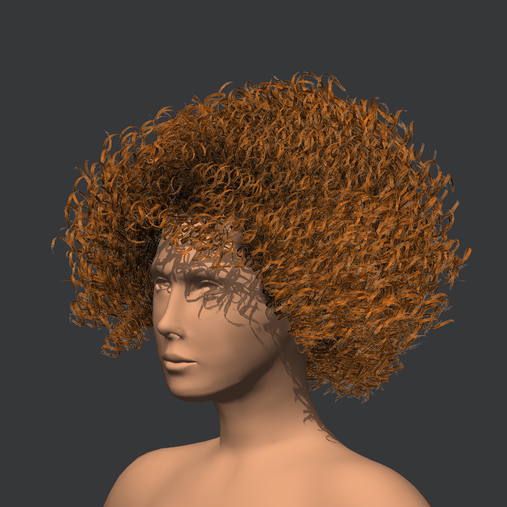

# Curly Volume

An editable ringlet hairstyle with 90 authored centerlines, a painted growth
footprint, three atlas strips, a matte URP material, and scalp vertex shading.
PointySwept remains a separate, unchanged example.

## Start here

Choose **UMA > Hair Cards > Examples > Curly Volume**, or open
**Curly_HairGroom**. Use the node tree as the navigator:

1. **Generate Hair > Curly Hair Cards > Ringlets**: change loop radius, spacing,
   winding and variation. These are procedural; the original guides stay editable.
2. **Guides / Grooming**: shape the broad silhouette upstream of the curls.
   Use **Edit This Layer** when prompted, then return to Final Preview.
3. **Hair Cards > Materials & UVs**: edit root/tip colors and Surface finish.
   Matte/Natural/Glossy change highlights only, not colors or textures.
4. **Hair Preview & Settings**: use Cards / Full. Hide guide splines and card
   wireframe to see the material clearly.

The [full Curly Volume guide](../../../../UMA/HairCards/CurlyVolumeGuide.md)
explains length behavior, masks, sampling, gravity, LODs and character binding.

## Included assets

- **Curly_HairGroom** is the editable source, not the generated mesh.
- **GeneratedCards** and **Curly_CardsPreview** are static full-detail outputs.
  Rebuild/bake from the groom after editing; these review outputs do not update
  merely because a parameter changes in the groom.
- **Curly_URP_Review** is a standalone lighting-review scene with an untextured
  body. It does not replace your project graphics settings. For matching lighting,
  assign the included ReviewPipeline in a separate test project's graphics/quality
  settings. Its renderer uses URP and 4x MSAA.
- **ShadedSourcePreview** demonstrates scalp vertex RGB on an owned mesh copy.
  It does not recolor the original body asset.
- **Curly_HairGroom Resources** contains the source snapshot, profile, atlas,
  material and owned texture copies. No files depend on the PointySwept example.

The default is a depth-writing, two-sided, MSAA alpha-cutout material with low
shine. Optional dithered coverage is available, but may look grainy without
temporal antialiasing; review motion before using it.

## Production use

This is a reconstruction of the reference's volume and curl pattern, not a
pixel-identical lighting/shader match. Fine alpha edges and shadows depend on your
lighting, resolution and antialiasing. Compare front, side and rear views while
adjusting width, radius, colors and density.

The authoring body is an **unrigged reference snapshot**. Use **Source & Setup >
Bind Character / Race** to attach actual slots and a skeleton before weight
copying, creating the slot-bound scalp Mesh Modifier, or baking wardrobe assets.
The preview prefab is deliberately not represented as animation-ready hair.

Use **Optimize & LODs** for runtime budgets. Full is intended for close-up review;
Draft reduces detail for interaction. See the
[validation report](../../../../UMA/HairCards/QA/CurlyVolumeValidation.md)
for measured rebuild cost and known limits.
