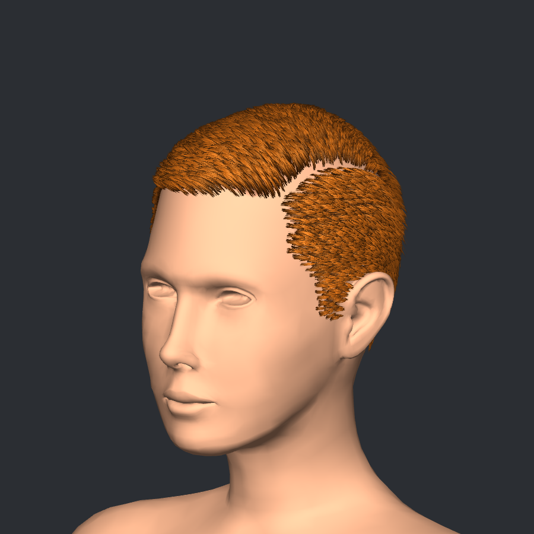
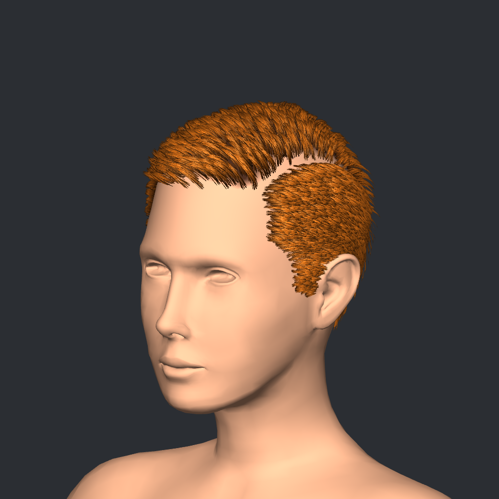
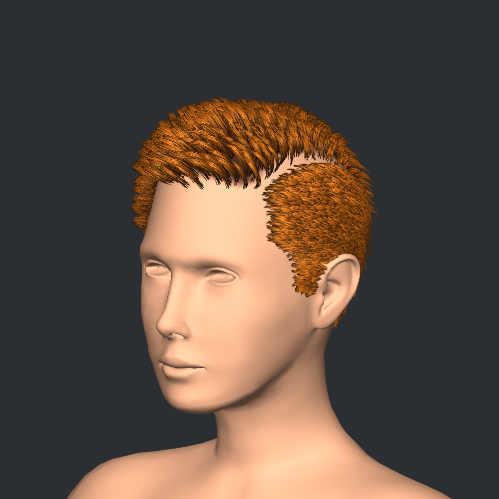

# ShortHairPart

Open **UMA → Hair Cards → Examples → Short Hair Part → Classic**, **Relaxed** or
**Close Cut**, **Natural** or **Front Flip Natural**. Each is an editable groom with 39 authored guides, separated into
crown and part-side groups. PointySwept, CurlyVolume and BraidedBun remain separate.

Both groups use **Texture map (precise)** at **32 texels per face edge**. The growth
footprint is reconstructed from smooth scalp regions, with tighter projection to
exclude ears. Select **Growth / Density** to inspect the true paint overlay, then
paint inside polygons without changing the source mesh, UVs, weights or guide anchors.
About 0.96 MiB of detailed texels are embedded in each groom; unedited faces reuse
the compact base field. Existing broad vertex shading is conservatively contained
inside the footprint so it cannot stain the forehead along a coarse triangle.

| Variant | LOD0 | LOD1 | LOD2 |
|---|---:|---:|---:|
| Classic | 19,784 tris | 9,606 tris | 3,424 tris |
| Relaxed | 19,768 tris | 9,720 tris | 3,544 tris |
| Close Cut | 19,792 tris | 9,666 tris | 3,416 tris |
| Natural | 19,384 tris | 9,950 tris | 3,144 tris |
| Front Flip Natural | 19,384 tris | 9,950 tris | 3,144 tris |

These are hair-only geometry counts, excluding the reference body. LOD0 is the
highest-detail output. The 20,000-triangle budget is advisory after edits, not an
automatic decimator. Four segments per ribbon and fewer, wider cards keep this
sample below the goal without changing the existing generation system.

Natural variants instead use eight crown segments and four side segments, with
fewer, wider crown cards. They add longer, wavier locks, strand-aligned 2D noise
and softer highlights. Front Flip Natural also has a repaintable forelock mask,
extra front length and **Surface Bend** for lift followed by a returning tip.
Select these named modifiers under each generated-card node to tune the result.
Their materials and profiles are independent of the original three styles.

Select **Generate Hair → Short hair part cards** to tune density and variation.
Select **Hair Cards → Geometry & Vertex Colors** for profile samples: five points
make four segments. Crown and side have independent profiles. **Materials & UVs**
contains root/tip color and shine/roughness controls. Textures are shared only
between the variants inside this folder; their materials are independent.

**Strand rendering** now defaults to **Hybrid**: opaque strand cores plus a lit,
alpha-blended fringe. **Alpha density** is 2.5 and **Opaque core cutoff** is 0.45.
This retains fine fibers without requiring MSAA. Switch to **Cutout** for lower
draw cost or **Alpha Blended** for a fully soft color pass. Hybrid adds a second
draw, not extra vertices: the table counts unique geometry, while two color
passes submit approximately twice those triangle counts. Transparency can still
show sorting artifacts. Inline color edits sync the fringe; after material
Inspector edits, use **Sync fringe from first pass**.

Close Cut also has zero root embedding and an editable **Scalp clearance lift**
at the end of each generated-card modifier list. This bends the shortened cards
outward along nearby surface normals while anchoring roots and preserving length.

The `*_Preview.prefab` assets contain three-LOD static hair meshes. The review
scene enables Classic; the other variants are inactive siblings. Enable only one
at a time. The neutral body shows scalp vertex shading and is not rigged. The
scene requires URP and does not switch the project's render-pipeline settings.
The Natural variants also include their own preview prefabs, preview images and
`ShortHairPart_Natural_URP_Review.unity`: Natural starts enabled, Front Flip Natural
is an inactive sibling. Enable only one at a time for an aligned comparison.

Groom edits update the authoring stage's live preview. Rebuild/bake to update saved
prefab meshes. For production UMA hair, bind the correct character/race slots,
copy weights, bake the scalp Mesh Modifier as needed and test animation.

Read the [Short Hair Part guide](../../../../UMA/HairCards/ShortHairPartGuide.md)
for the workflow, variations, atlas setup and polygon-budget controls.

